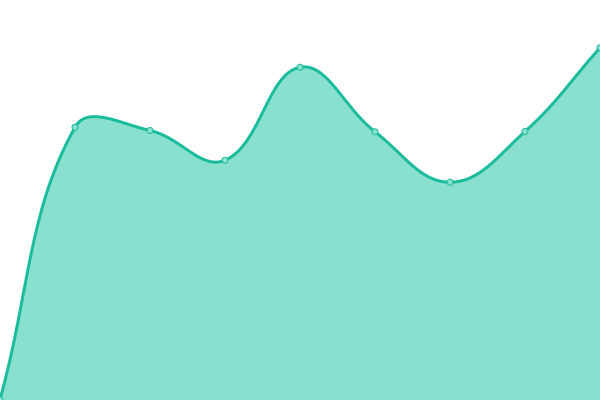
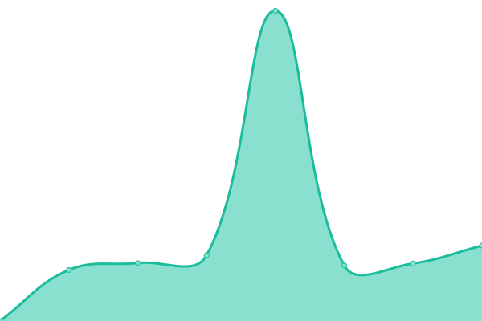

# [📈 Live Status](https://hosseinn.github.io): <!--live status--> **🟧 Partial outage**

This repository contains the open-source uptime monitor and status page for [Hossein](https://hosseinn.github.io), powered by [Upptime](https://github.com/upptime/upptime).

With [Upptime](https://upptime.js.org), you can get your own unlimited and free uptime monitor and status page, powered entirely by a GitHub repository. We use [Issues](https://github.com/hosseinn/upptime/issues) as incident reports, [Actions](https://github.com/hosseinn/upptime/actions) as uptime monitors, and [Pages](https://hosseinn.github.io) for the status page.

<!--start: status pages-->
<!-- This summary is generated by Upptime (https://github.com/upptime/upptime) -->
<!-- Do not edit this manually, your changes will be overwritten -->
<!-- prettier-ignore -->
| URL | Status | History | Response Time | Uptime |
| --- | ------ | ------- | ------------- | ------ |
|  [LibreOffice Website](https://www.libreoffice.org/) | 🟩 Up | [libre-office-website.yml](https://github.com/hosseinn/upptime/commits/HEAD/history/libre-office-website.yml) | 

 1168ms
     
 | 

<a href="https://hosseinn.github.io/history/libre-office-website">100.00%</a>
    

|  [The Document Foundation's official blog](https://blog.documentfoundation.org/) | 🟩 Up | [the-document-foundation-s-official-blog.yml](https://github.com/hosseinn/upptime/commits/HEAD/history/the-document-foundation-s-official-blog.yml) | 

 1040ms
     
 | 

<a href="https://hosseinn.github.io/history/the-document-foundation-s-official-blog">100.00%</a>
    

|  [The Document Foundation Planet](https://planet.documentfoundation.org/) | 🟩 Up | [the-document-foundation-planet.yml](https://github.com/hosseinn/upptime/commits/HEAD/history/the-document-foundation-planet.yml) | 

 1312ms
     
 | 

<a href="https://hosseinn.github.io/history/the-document-foundation-planet">100.00%</a>
    

|  [AskLibO](https://ask.libreoffice.org/) | 🟩 Up | [ask-lib-o.yml](https://github.com/hosseinn/upptime/commits/HEAD/history/ask-lib-o.yml) | 

 1442ms
     
 | 

<a href="https://hosseinn.github.io/history/ask-lib-o">100.00%</a>
    

|  [Download (MirrorBrain)](https://download.documentfoundation.org/) | 🟩 Up | [download-mirror-brain.yml](https://github.com/hosseinn/upptime/commits/HEAD/history/download-mirror-brain.yml) | 

 1635ms
     
 | 

<a href="https://hosseinn.github.io/history/download-mirror-brain">100.00%</a>
    

|  [Download Archives](https://downloadarchive.documentfoundation.org/) | 🟩 Up | [download-archives.yml](https://github.com/hosseinn/upptime/commits/HEAD/history/download-archives.yml) | 

 909ms
     
 | 

<a href="https://hosseinn.github.io/history/download-archives">100.00%</a>
    

|  [LibreOffice Extensions and Templates](https://extensions.libreoffice.org/) | 🟥 Down | [libre-office-extensions-and-templates.yml](https://github.com/hosseinn/upptime/commits/HEAD/history/libre-office-extensions-and-templates.yml) | 

 1322ms
     
 | 

<a href="https://hosseinn.github.io/history/libre-office-extensions-and-templates">100.00%</a>
    

|  [Online Help](https://help.libreoffice.org/) | 🟩 Up | [online-help.yml](https://github.com/hosseinn/upptime/commits/HEAD/history/online-help.yml) | 

 687ms
     
 | 

<a href="https://hosseinn.github.io/history/online-help">100.00%</a>
    

|  [TDF Wiki](https://wiki.documentfoundation.org/) | 🟩 Up | [tdf-wiki.yml](https://github.com/hosseinn/upptime/commits/HEAD/history/tdf-wiki.yml) | 

 1441ms
     
 | 

<a href="https://hosseinn.github.io/history/tdf-wiki">100.00%</a>
    

|  [Bugzilla](https://bugs.documentfoundation.org/) | 🟩 Up | [bugzilla.yml](https://github.com/hosseinn/upptime/commits/HEAD/history/bugzilla.yml) | 

 1056ms
     
 | 

<a href="https://hosseinn.github.io/history/bugzilla">100.00%</a>
    

|  [CI (Jenkins)](https://ci.libreoffice.org/) | 🟩 Up | [ci-jenkins.yml](https://github.com/hosseinn/upptime/commits/HEAD/history/ci-jenkins.yml) | 

 1574ms
     
 | 

<a href="https://hosseinn.github.io/history/ci-jenkins">100.00%</a>
    

|  [Grimoire Dashboard](https://dashboard.documentfoundation.org/) | 🟩 Up | [grimoire-dashboard.yml](https://github.com/hosseinn/upptime/commits/HEAD/history/grimoire-dashboard.yml) | 

 1140ms
     
 | 

<a href="https://hosseinn.github.io/history/grimoire-dashboard">100.00%</a>
    

|  [dev-builds](https://dev-builds.libreoffice.org/) | 🟩 Up | [dev-builds.yml](https://github.com/hosseinn/upptime/commits/HEAD/history/dev-builds.yml) | 

 928ms
     
 | 

<a href="https://hosseinn.github.io/history/dev-builds">100.00%</a>
    

|  [dev-downloads](https://dev-downloads.libreoffice.org/) | 🟩 Up | [dev-downloads.yml](https://github.com/hosseinn/upptime/commits/HEAD/history/dev-downloads.yml) | 

 559ms
     
 | 

<a href="https://hosseinn.github.io/history/dev-downloads">100.00%</a>
    

|  [dev-www](https://dev-www.libreoffice.org/) | 🟩 Up | [dev-www.yml](https://github.com/hosseinn/upptime/commits/HEAD/history/dev-www.yml) | 

 614ms
     
 | 

<a href="https://hosseinn.github.io/history/dev-www">100.00%</a>
    

|  [Gerrit Code Review](https://gerrit.libreoffice.org/) | 🟩 Up | [gerrit-code-review.yml](https://github.com/hosseinn/upptime/commits/HEAD/history/gerrit-code-review.yml) | 

 610ms
     
 | 

<a href="https://hosseinn.github.io/history/gerrit-code-review">100.00%</a>
    

|  [OpenGrok](https://opengrok.libreoffice.org/) | 🟩 Up | [open-grok.yml](https://github.com/hosseinn/upptime/commits/HEAD/history/open-grok.yml) | 

 751ms
     
 | 

<a href="https://hosseinn.github.io/history/open-grok">100.00%</a>
    

|  [Weblate (l10n)](https://translations.documentfoundation.org/) | 🟩 Up | [weblate-l10n.yml](https://github.com/hosseinn/upptime/commits/HEAD/history/weblate-l10n.yml) | 

 805ms
     
 | 

<a href="https://hosseinn.github.io/history/weblate-l10n">100.00%</a>
    

|  [TDF/LibO events (Pretalx)](https://events.documentfoundation.org/) | 🟩 Up | [tdf-lib-o-events-pretalx.yml](https://github.com/hosseinn/upptime/commits/HEAD/history/tdf-lib-o-events-pretalx.yml) | 

 685ms
     
 | 

<a href="https://hosseinn.github.io/history/tdf-lib-o-events-pretalx">100.00%</a>
    

|  [Nextcloud](https://nextcloud.documentfoundation.org/core/js/oc.js) | 🟩 Up | [nextcloud.yml](https://github.com/hosseinn/upptime/commits/HEAD/history/nextcloud.yml) | 

 608ms
     
 | 

<a href="https://hosseinn.github.io/history/nextcloud">100.00%</a>
    

|  [The Document Foundation Elections and Referenda](https://elections.documentfoundation.org/) | 🟩 Up | [the-document-foundation-elections-and-referenda.yml](https://github.com/hosseinn/upptime/commits/HEAD/history/the-document-foundation-elections-and-referenda.yml) | 

 572ms
     
 | 

<a href="https://hosseinn.github.io/history/the-document-foundation-elections-and-referenda">100.00%</a>
    

|  [Etherpad](https://pad.documentfoundation.org/) | 🟩 Up | [etherpad.yml](https://github.com/hosseinn/upptime/commits/HEAD/history/etherpad.yml) | 

 568ms
     
 | 

<a href="https://hosseinn.github.io/history/etherpad">100.00%</a>
    

|  [Matomo](https://piwik.documentfoundation.org/) | 🟩 Up | [matomo.yml](https://github.com/hosseinn/upptime/commits/HEAD/history/matomo.yml) | 

 1445ms
     
 | 

<a href="https://hosseinn.github.io/history/matomo">100.00%</a>
    

|  [The Document Foundation Redmine](https://redmine.documentfoundation.org/) | 🟩 Up | [the-document-foundation-redmine.yml](https://github.com/hosseinn/upptime/commits/HEAD/history/the-document-foundation-redmine.yml) | 

 541ms
     
 | 

<a href="https://hosseinn.github.io/history/the-document-foundation-redmine">100.00%</a>
    

|  [LimeSurvey](https://survey.documentfoundation.org/) | 🟩 Up | [lime-survey.yml](https://github.com/hosseinn/upptime/commits/HEAD/history/lime-survey.yml) | 

 804ms
     
 | 

<a href="https://hosseinn.github.io/history/lime-survey">100.00%</a>
    

|  [Authentication Portal](https://auth.documentfoundation.org/) | 🟩 Up | [authentication-portal.yml](https://github.com/hosseinn/upptime/commits/HEAD/history/authentication-portal.yml) | 

 614ms
     
 | 

<a href="https://hosseinn.github.io/history/authentication-portal">100.00%</a>
    

<!--end: status pages-->

[**Visit our status website →**](https://hosseinn.github.io)

## 📄 License

- Powered by: [Upptime](https://github.com/upptime/upptime)
- Code: [MIT](./LICENSE) © [Hossein](https://hosseinn.github.io)
- Data in the `./history` directory: [Open Database License](https://opendatacommons.org/licenses/odbl/1-0/)
